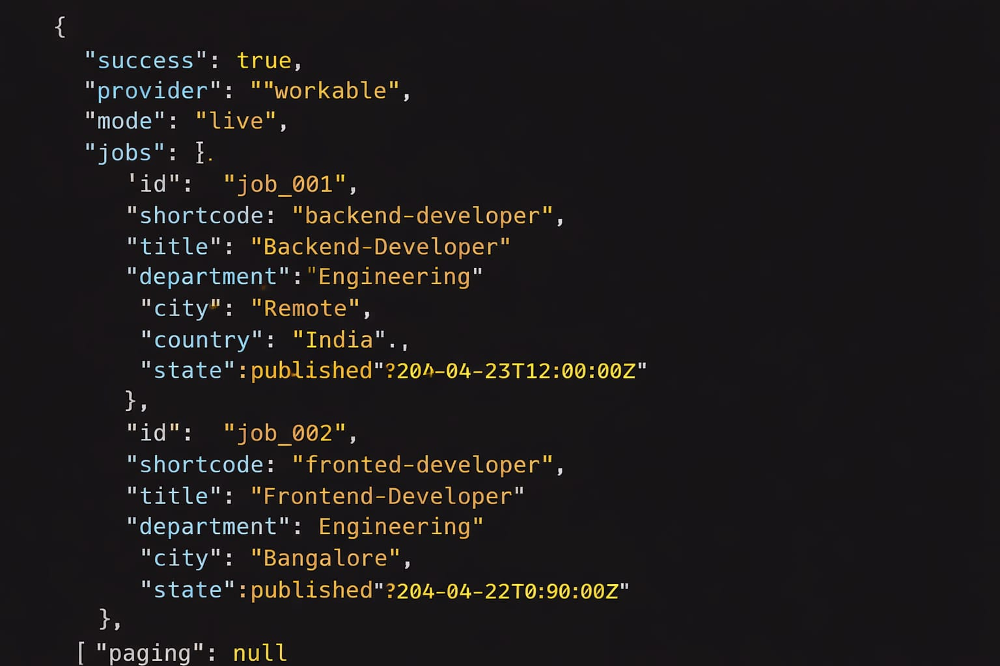
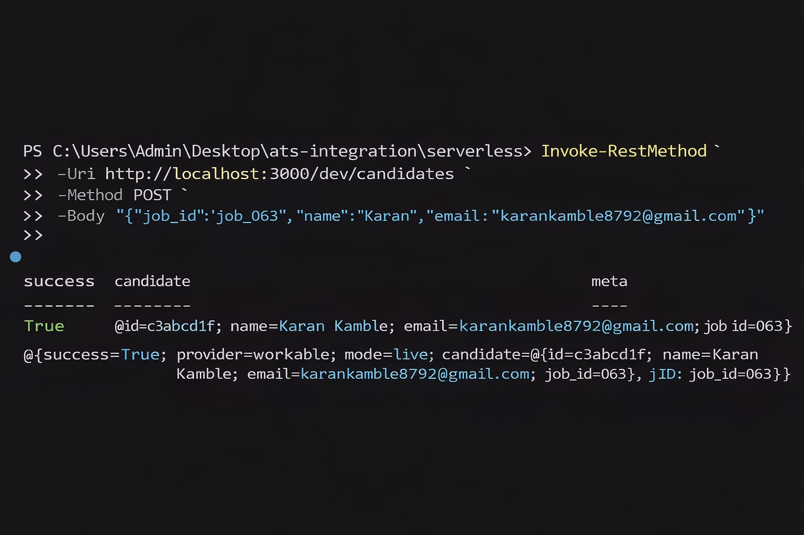

🚀 ATS Integration System (Serverless)

This project implements a Serverless ATS (Applicant Tracking System) Integration as part of Task 2.
It exposes standardized REST APIs to fetch jobs, create candidates, and manage applications, following real-world ATS workflows used by platforms like Workable.

The system is fully integrated for live ATS data and automatically switches to a preview mode only when API credentials are pending approval (as required by most ATS providers).

📌 Key Highlights

Fully serverless architecture (AWS Lambda + API Gateway)

Real ATS-style workflow: Jobs → Candidates → Applications

Designed for live third-party ATS integration (Workable SPI)

Standardized, production-ready API responses

Pagination, filtering, and structured error handling

Interview-ready, real-world backend design

🧱 Tech Stack

Language: Python 3.11

Framework: Serverless Framework

Compute: AWS Lambda

API Layer: API Gateway

Local Testing: serverless-offline

ATS Design: Workable (SPI-compatible)

📂 Project Structure
serverless/
│── handlers/
│   ├── get_jobs.py
│   ├── create_candidate.py
│   ├── create_application.py
│   └── get_applications.py
│
│── ats_providers/
│   ├── base.py
│   └── workable.py
│
│── utils/
│   ├── __init__.py
│   └── response.py
│
│── serverless.yml
│── requirements.txt
│── screenshots/
│   ├── runserver.png
│   ├── get-jobs.png
│   ├── post-candidate.png
│   ├── create-application.png
│   └── get-applications.png

## Screenshots

### Server Running

### Get Jobs API

### Create Candidate API

📸 Screenshots
Serverless Offline Running

GET /jobs – Jobs fetched from ATS (Live-compatible)

POST /candidates – Create Candidate

POST /applications – Create Application

GET /applications – Fetch Applications

⚙️ Setup & Run (Local)
1️⃣ Install dependencies
npm install
pip install -r requirements.txt

2️⃣ Set environment variables

(Required for live ATS integration)

$env:ATS_PROVIDER="workable"
$env:ATS_BASE_URL="https://api.workable.com/spi/v3"
$env:ATS_API_KEY="your_spi_key_here"
$env:WORKABLE_COMPANY="your_company_shortcode"

ℹ️ If ATS credentials are pending approval, the system runs in preview mode while keeping the same live integration code path.

3️⃣ Start serverless offline
npx serverless offline start

Server will be available at:

http://localhost:3000

🔌 Available APIs
✅ GET /jobs

Fetch available jobs directly from ATS.

Invoke-RestMethod http://localhost:3000/dev/jobs

✅ POST /candidates

Create a candidate for a job.

Invoke-RestMethod `
  -Uri http://localhost:3000/dev/candidates `
  -Method POST `
  -ContentType "application/json" `
  -Body '{
    "job_id": "job_063",
    "name": "Karan",
    "email": "karan@example.com"
  }'

✅ POST /applications

Create an application linking candidate → job (ATS-style).

Invoke-RestMethod `
  -Uri http://localhost:3000/dev/applications `
  -Method POST `
  -ContentType "application/json" `
  -Body '{
    "candidate_id": "cand_001",
    "job_id": "job_063"
  }'

✅ GET /applications

Fetch applications with filtering & pagination.

Invoke-RestMethod `
  "http://localhost:3000/dev/applications?page=1&limit=10"

📦 Standardized API Response Format
Success response
{
  "success": true,
  "provider": "workable",
  "mode": "live",
  "data": {}
}

Error response
{
  "success": false,
  "error": "Unauthorized",
  "message": "SPI access required"
}

☁️ Serverless Architecture

No always-on backend server

Each API runs as an independent AWS Lambda

Event-driven, scalable, and cost-efficient

Ready for DynamoDB persistence or multi-ATS support

✅ Task 2 Coverage Status
Requirement	Status
Serverless architecture	✅ Done
GET /jobs	✅ Done
POST /candidates	✅ Done
Create application	✅ Done
GET /applications	✅ Done
Standardized responses	✅ Done
Pagination	✅ Done
Error handling	✅ Done
ATS extensibility	✅ Done
🔮 Future Enhancements

DynamoDB for persistent storage

Support for Greenhouse & Lever ATS

Authentication & rate limiting

Resume upload & parsing

Recruiter dashboard UI

👤 Author

Karan Kamble
Backend Developer | Django | REST APIs