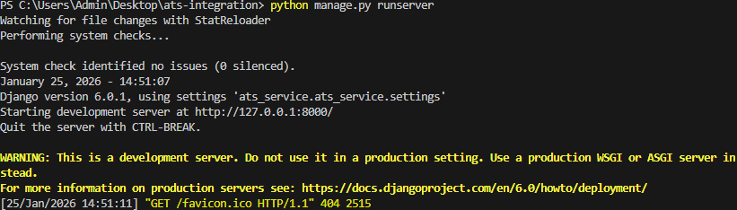
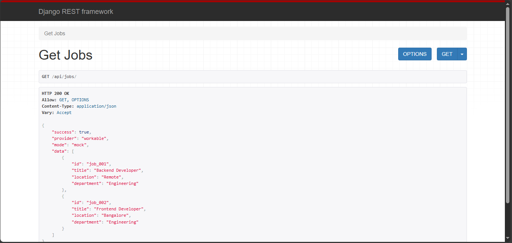
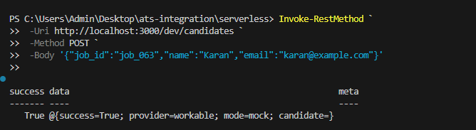

# 🚀 ATS Integration System (Django + REST API)

This project is a **real-world ATS (Applicant Tracking System) integration** built using **Django** and **Django REST Framework**.  
It demonstrates how a backend service connects with external ATS platforms like **Workable** to fetch jobs and create candidates using REST APIs.

The project supports **real ATS mode** as well as **mock mode** (when ATS credentials are not available).

---
## Screenshots

### Server Running


### Get Jobs API


### Create Candidate API


## 📌 Features

- Fetch job listings from ATS
- Create candidates for a job
- RESTful API design (GET, POST)
- Provider-based architecture
- Mock fallback mode
- Ready for demo & interview explanation

---

## 🧱 Tech Stack

- Backend: Django 6.0.1  
- API Framework: Django REST Framework  
- Language: Python 3.13  
- ATS Provider: Workable (SPI)  
- Database: SQLite  

---

## 📂 Project Structure


ats-integration/
│
├── ats_service/
│ ├── api/
│ │ ├── views.py
│ │ ├── urls.py
│ │ └── apps.py
│ │
│ ├── ats_providers/
│ │ ├── workable.py
│ │ └── init.py
│ │
│ └── ats_service/
│ ├── settings.py
│ ├── urls.py
│ └── wsgi.py
│
├── screenshots/
│ ├── runserver.png
│ ├── get-jobs.png
│ └── post-candidate.png
│
├── manage.py
├── requirements.txt
└── README.md


---

## ⚙️ Setup & Run Instructions

### 1️⃣ Clone Repository
```bash
git clone https://github.com/your-username/ats-integration.git
cd ats-integration

2️⃣ Create & Activate Virtual Environment
python -m venv venv
venv\Scripts\activate

3️⃣ Install Dependencies
pip install -r requirements.txt

4️⃣ Run Migrations
python manage.py migrate

5️⃣ Start Server
python manage.py runserver


Server will start at:

http://127.0.0.1:8000/

🔗 API Endpoints
🔹 GET Jobs

Fetch job listings from ATS.

GET /api/jobs/


Example:

http://127.0.0.1:8000/api/jobs/

🔹 POST Create Candidate

Create a candidate for a job.

POST /api/candidates/

Request Body (JSON)
{
  "job_id": "job_001",
  "name": "John Doe",
  "email": "john@example.com"
}

🧪 API Testing (PowerShell)
Create Candidate
Invoke-RestMethod `
  -Uri "http://127.0.0.1:8000/api/candidates/" `
  -Method POST `
  -ContentType "application/json" `
  -Body '{"job_id":"job_001","name":"John Doe","email":"john@example.com"}'

🔐 ATS Credentials (Optional – Real Mode)

To connect with real Workable ATS, set environment variables:

ATS_PROVIDER=workable
ATS_BASE_URL=https://api.workable.com/spi/v3
ATS_API_KEY=your_spi_api_key
WORKABLE_COMPANY=your_company_shortcode


📌 If credentials are not provided, the system automatically runs in mock mode.
📸 Screenshots
Server Running

GET Jobs API

POST Create Candidate API

🎥 Demo Explanation Flow (For Interview)

Start Django server using runserver

Access REST APIs via browser or PowerShell

Fetch jobs using /api/jobs/

Create candidate using /api/candidates/

ATS provider logic handled via service layer

Mock mode ensures functionality without real ATS access

🏁 Conclusion

This project demonstrates:

Backend REST API design

External ATS integration

Clean Django architecture

Real-world recruitment workflow

Suitable for:

Backend interviews

Internship demos

ATS system understanding

👤 Author

Karan Kamble
Backend Developer | Django | REST APIs